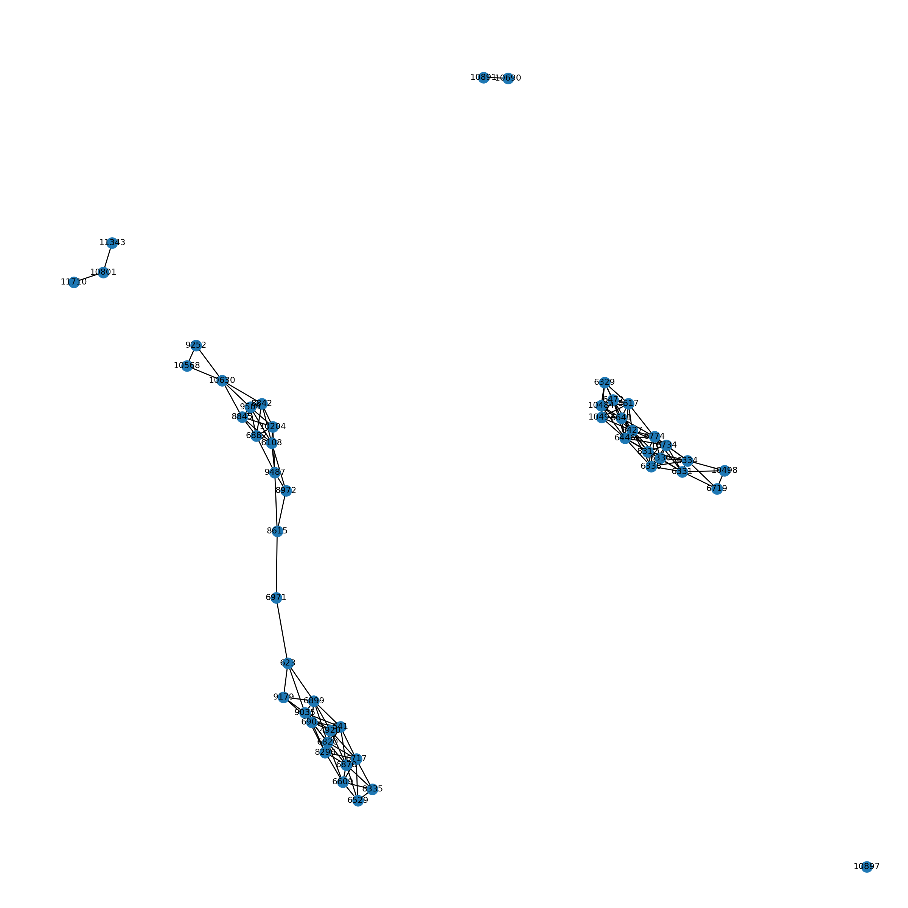

# Automated Fraud Detection System for Financial Transactions

## Overview
This project leverages machine learning and natural language processing (NLP) techniques to identify and classify potentially fraudulent credit card transactions. It is designed for high-volume financial environments where anomaly detection is critical for mitigating risks and operational losses.

## Key Features
- **Data Preprocessing**: Scales and normalizes transaction amounts, removes irrelevant columns.
- **Modeling**: Trained using a **Random Forest Classifier** for high accuracy on imbalanced data.
- **Evaluation**: Generates confusion matrix and classification report to assess precision, recall, and F1-score.
- **Visualization**: Graph-based fraud network analysis using `networkx`.
- **NLP Module**: Extracts entities from financial texts using **spaCy**.
- **Model Persistence**: Saves the model using `joblib` for deployment or reuse.

## Tech Stack

| Category           | Tools & Libraries         |
|--------------------|--------------------------|
| Programming        | Python                   |
| Data Processing    | Pandas, NumPy            |
| Machine Learning   | Scikit-learn             |
| NLP                | spaCy                    |
| Visualization      | NetworkX, Matplotlib     |
| Model Persistence  | Joblib                   |
| IDE/Notebook       | Jupyter Notebook         |

## Project Structure
```
Automated-Fraud-Detection-System
├── Creditcard.py              # Main Jupyter script
├── README.md                      # Project documentation
├── fraud_detection_model.joblib   # Saved trained model
└── assets/
    └── fraud_network_graph.png    # Visuals used in README
```

## Results Snapshot

Sample output from `classification_report`:
```
              precision    recall  f1-score   support

           0       1.00      1.00      1.00     56863
           1       0.93      0.80      0.86        99

    accuracy                           1.00     56962
   macro avg       0.96      0.90      0.93     56962
weighted avg       1.00      1.00      1.00     56962
```

Sample graph visualization of fraudulent transactions:


## How to Use

1. Clone the repository:
   ```bash
   git clone https://github.com/tsen057/Automated-Fraud-Detection-System.git
   cd Automated-Fraud-Detection-System
   ```

2. Install dependencies:
   ```bash
   pip install -r requirements.txt
   ```

3. Run the script:
   ```bash
   jupyter notebook
   ```

4. View insights, train model, analyze NLP output.

## Dataset Reference
Dataset used: [Credit Card Fraud Detection on Kaggle](https://www.kaggle.com/datasets/mlg-ulb/creditcardfraud)

## Future Improvements
- Add **class imbalance handling** using SMOTE or other techniques.
- Deploy the model via **Flask API** or **Streamlit app**.
- Integrate **real-time prediction** module with streaming data.
- Extend NLP module to ingest real financial documents and emails.

## Author
**Tejaswini Sengaonkar**  
[LinkedIn](https://www.linkedin.com/in/tejaswini-sengaonkar) | [GitHub](https://github.com/tsen057)
